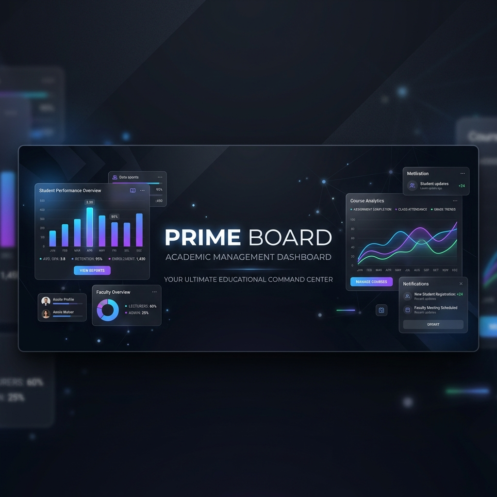
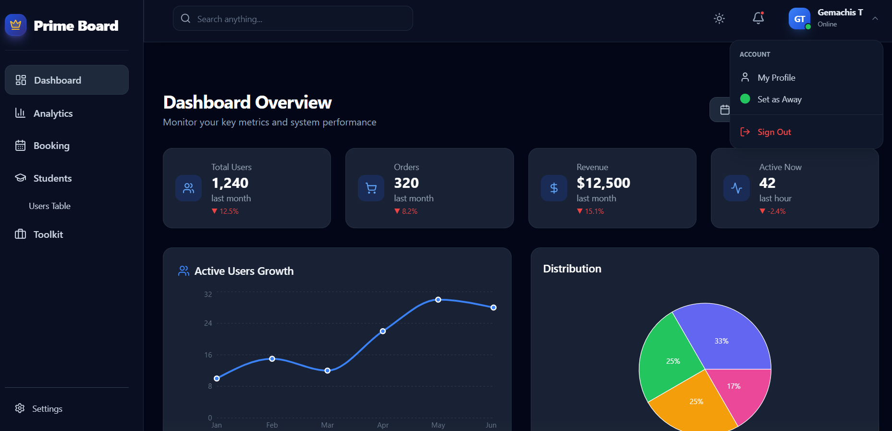
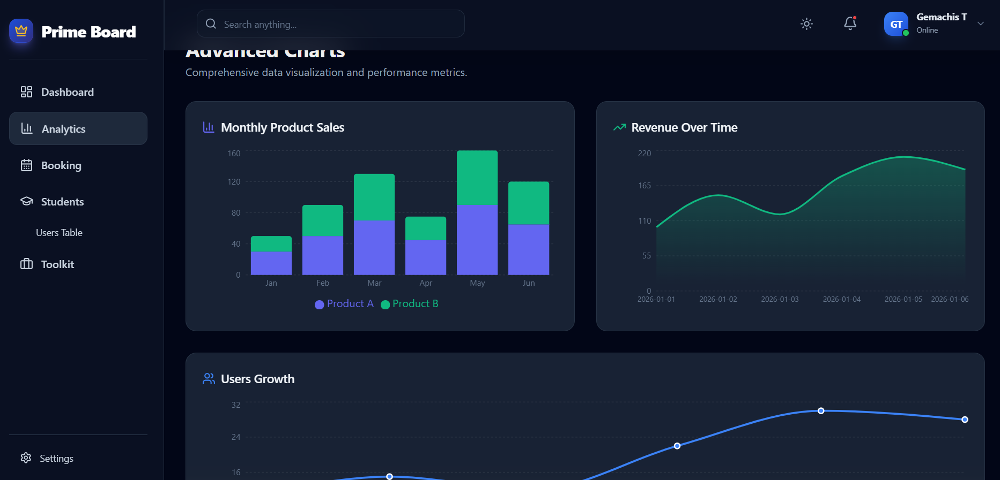
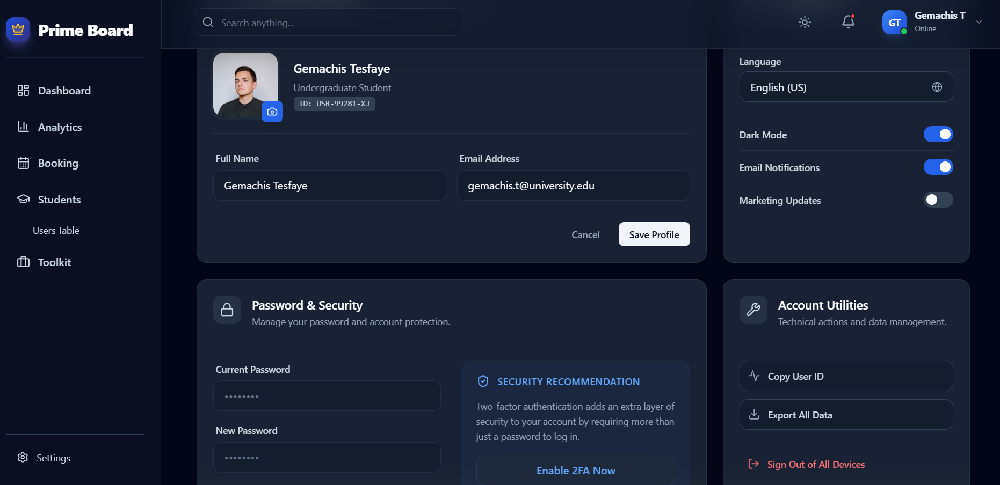
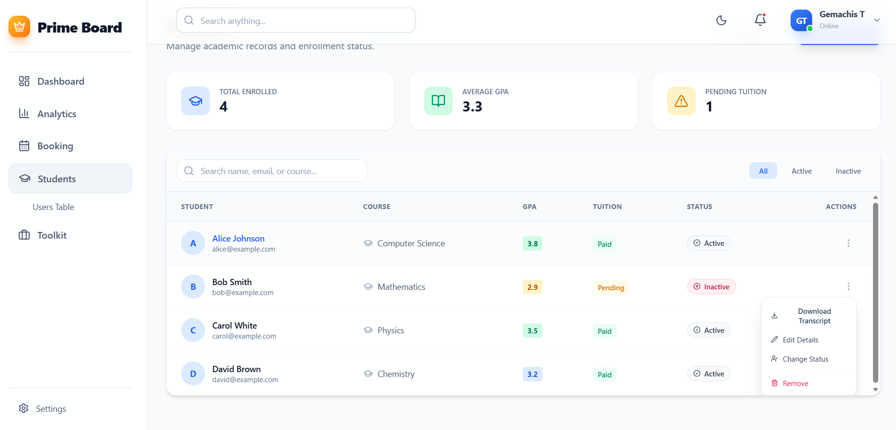
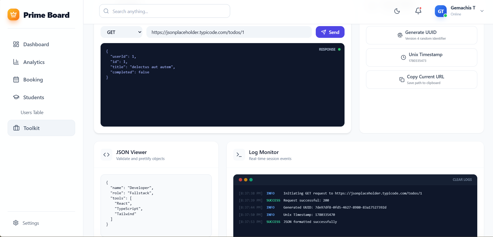

<div align="center">
  
  
  # 🎓 Prime Board 
  **Premium Academic Management Dashboard** ✨

  [](https://reactjs.org/)
  [](https://vitejs.dev/)
  [](https://tailwindcss.com/)
  [](https://parall.ax/products/jspdf)
</div>

---

## 🚀 Overview

**Prime Board** is a high-fidelity, modern administrative dashboard designed for universities and academic institutions. It provides a seamless, dark-mode-first user experience for managing students, generating official academic transcripts, and analyzing institutional data.

## 📸 Screenshots

| 🖥️ Main Dashboard Overview | 📈 Advanced Analytics |
|:---:|:---:|
|  |  |
| **⚙️ Settings & Theme** | **👥 Users & Students Table** |
|  |  |
| **📅 Booking Interface** | **🧰 Academic Toolkit** |
|  |  |

## ✨ Key Features

- 🌓 **Dark Mode First:** Sleek, modern aesthetic featuring glassmorphism and a responsive vertical sidebar layout.
- 🎓 **Dynamic Student Management:** Complete CRUD capabilities for student records, enrollment statuses, and GPAs.
- 📄 **Professional PDF Transcripts:** Automated, high-quality PDF generation for academic transcripts using `jspdf` and `jspdf-autotable`.
- 📊 **Real-time Analytics:** Interactive dashboard metrics to track pending tuition, enrollment counts, and average GPAs.
- 📱 **Fully Responsive:** Carefully crafted layouts that look perfect on desktop, tablet, and mobile displays.

## 🛠️ Quick Start

### Prerequisites
Make sure you have [Node.js](https://nodejs.org/) installed on your machine.

### Installation

1. **Clone the repository**
   ```bash
   git clone https://github.com/gemachistesfaye/PrimeBoard-React.git
   cd PrimeBoard-React
   ```

2. **Install dependencies**
   ```bash
   npm install
   ```

3. **Run the development server**
   ```bash
   npm run dev
   ```

4. **Open your browser**
   Navigate to `http://localhost:5173` to view the dashboard.

## 📂 Project Structure

```text
PrimeBoard-React/
├── public/                 # Static assets (Favicons, Logos)
├── src/
│   ├── components/         # Reusable UI components (Navbar, Sidebar, Layout)
│   ├── pages/              # Primary application views (Dashboard, Students, etc.)
│   ├── App.jsx             # Main application entry point & routing
│   └── index.css           # Global Tailwind utilities and base styles
├── .github/                # GitHub Actions & Issue Templates
└── package.json            # Project dependencies and scripts
```

## 🔒 Security

We take security seriously! 🛡️ Please review our [Security Policy](SECURITY.md) for information on how to securely report vulnerabilities and our support guidelines.

## 📜 License

This project is licensed under the [MIT License](LICENSE).
